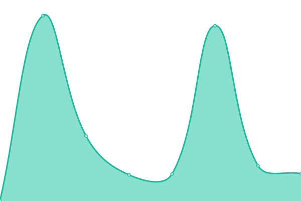

# [📈 Live Status](https://uptime.overlordmc.net): <!--live status--> **🟥 Complete outage**

This repository contains the open-source uptime monitor and status page for [Overlord-Factions](https://uptime.overlordmc.net), powered by [Upptime](https://github.com/upptime/upptime).

With [Upptime](https://upptime.js.org), you can get your own unlimited and free uptime monitor and status page, powered entirely by a GitHub repository. We use [Issues](https://github.com/Overlord-Factions/upptime/issues) as incident reports, [Actions](https://github.com/Overlord-Factions/upptime/actions) as uptime monitors, and [Pages](https://uptime.overlordmc.net) for the status page.

<!--start: status pages-->
<!-- This summary is generated by Upptime (https://github.com/upptime/upptime) -->
<!-- Do not edit this manually, your changes will be overwritten -->
<!-- prettier-ignore -->
| URL | Status | History | Response Time | Uptime |
| --- | ------ | ------- | ------------- | ------ |
|  [Server](overlordmc.net) | 🟥 Down | [server.yml](https://github.com/Overlord-Factions/upptime/commits/HEAD/history/server.yml) | 

 0ms
     
 | 

<a href="https://uptime.overlordmc.net/history/server">0.00%</a>
    

|  [Server Website](https://overlordmc.net) | 🟥 Down | [server-website.yml](https://github.com/Overlord-Factions/upptime/commits/HEAD/history/server-website.yml) | 

 81ms
     
 | 

<a href="https://uptime.overlordmc.net/history/server-website">0.00%</a>
    

|  [Server Map](https://map.overlordmc.net) | 🟥 Down | [server-map.yml](https://github.com/Overlord-Factions/upptime/commits/HEAD/history/server-map.yml) | 

 101ms
     
 | 

<a href="https://uptime.overlordmc.net/history/server-map">0.00%</a>
    

|  Server Map Backend | 🟥 Down | [server-map-backend.yml](https://github.com/Overlord-Factions/upptime/commits/HEAD/history/server-map-backend.yml) | 

 0ms
     
 | 

<a href="https://uptime.overlordmc.net/history/server-map-backend">0.00%</a>
    

|  [Server Stats (Admin Only)](https://stats.overlordmc.net) | 🟥 Down | [server-stats-admin-only.yml](https://github.com/Overlord-Factions/upptime/commits/HEAD/history/server-stats-admin-only.yml) | 

 0ms
     
 | 

<a href="https://uptime.overlordmc.net/history/server-stats-admin-only">0.00%</a>
    

|  [Management Panel (Admin Only)](https://panel.overlordmc.net) | 🟥 Down | [management-panel-admin-only.yml](https://github.com/Overlord-Factions/upptime/commits/HEAD/history/management-panel-admin-only.yml) | 

 68ms
     
 | 

<a href="https://uptime.overlordmc.net/history/management-panel-admin-only">0.00%</a>
    

<!--end: status pages-->

[**Visit our status website →**](https://uptime.overlordmc.net)

## 📄 License

- Powered by: [Upptime](https://github.com/upptime/upptime)
- Code: [MIT](./LICENSE) © [Overlord-Factions](https://uptime.overlordmc.net)
- Data in the `./history` directory: [Open Database License](https://opendatacommons.org/licenses/odbl/1-0/)
